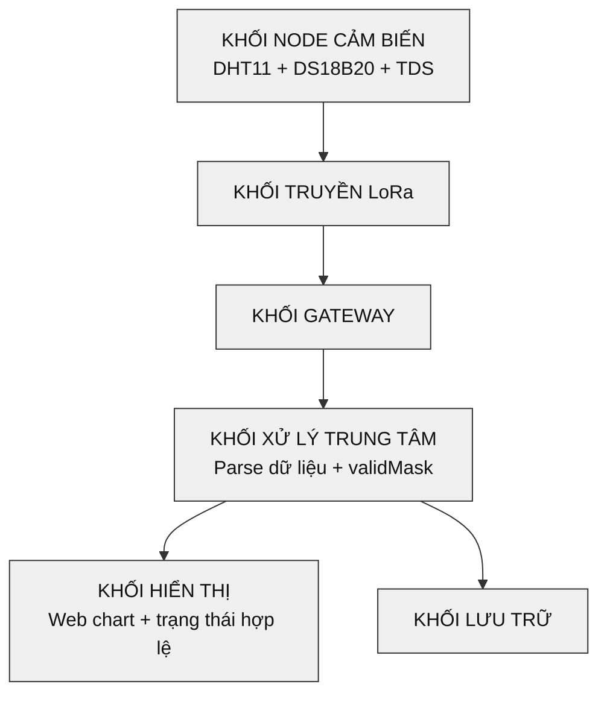

# Sơ đồ khối hệ thống (dạng block đơn giản)

```mermaid
flowchart TB
    A[KHỐI NODE CẢM BIẾN<br/>DHT11 + DS18B20 + TDS]
    B[KHỐI TRUYỀN LoRa]
    C[KHỐI GATEWAY]
    D[KHỐI XỬ LÝ TRUNG TÂM<br/>Parse dữ liệu + validMask]
    E[KHỐI HIỂN THỊ<br/>Web chart + trạng thái hợp lệ]
    F[KHỐI LƯU TRỮ]

    A --> B --> C --> D
    D --> E
    D --> F

    style A fill:#efefef,stroke:#333,stroke-width:1px,color:#111
    style B fill:#efefef,stroke:#333,stroke-width:1px,color:#111
    style C fill:#efefef,stroke:#333,stroke-width:1px,color:#111
    style D fill:#efefef,stroke:#333,stroke-width:1px,color:#111
    style E fill:#efefef,stroke:#333,stroke-width:1px,color:#111
    style F fill:#efefef,stroke:#333,stroke-width:1px,color:#111
```
