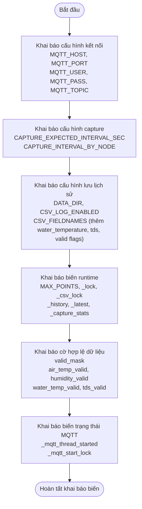

# Sơ đồ khối phần khai báo biến (web backend)

```mermaid
flowchart TB
    A([Bắt đầu])

    B["Khai báo cấu hình kết nối<br/>MQTT_HOST, MQTT_PORT<br/>MQTT_USER, MQTT_PASS, MQTT_TOPIC"]
    C["Khai báo cấu hình capture<br/>CAPTURE_EXPECTED_INTERVAL_SEC<br/>CAPTURE_INTERVAL_BY_NODE"]
    D["Khai báo cấu hình lưu lịch sử<br/>DATA_DIR, CSV_LOG_ENABLED<br/>CSV_FIELDNAMES (thêm water_temperature, tds, valid flags)"]
    E["Khai báo biến runtime<br/>MAX_POINTS, _lock, _csv_lock<br/>_history, _latest, _capture_stats"]
    F["Khai báo cờ hợp lệ dữ liệu<br/>valid_mask<br/>air_temp_valid, humidity_valid<br/>water_temp_valid, tds_valid"]
    G["Khai báo biến trạng thái MQTT<br/>_mqtt_thread_started<br/>_mqtt_start_lock"]

    H([Hoàn tất khai báo biến])

    A --> B --> C --> D --> E --> F --> G --> H
```
