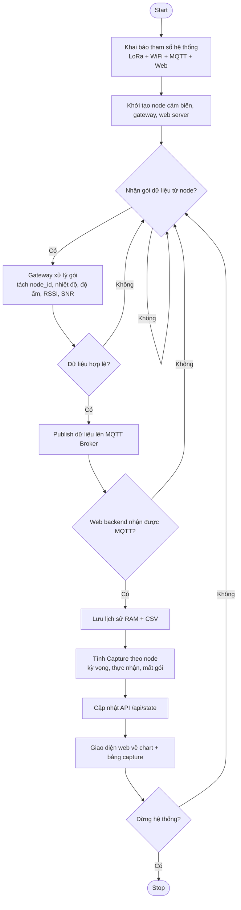

# Sơ đồ khối hệ thống dạng luồng xử lý

```mermaid
flowchart TD
    A([Start]) --> B[Khai báo tham số hệ thống<br/>LoRa + WiFi + MQTT + Web]
    B --> C[Khởi tạo node cảm biến, gateway, web server]
    C --> D{Nhận gói dữ liệu từ node?}

    D -- "Không" --> D
    D -- "Có" --> E[Gateway xử lý gói<br/>tách node_id, nhiệt độ, độ ẩm, RSSI, SNR]

    E --> F{Dữ liệu hợp lệ?}
    F -- "Không" --> D
    F -- "Có" --> G[Publish dữ liệu lên MQTT Broker]

    G --> H{Web backend nhận được MQTT?}
    H -- "Không" --> D
    H -- "Có" --> I[Lưu lịch sử RAM + CSV]

    I --> J[Tính Capture theo node<br/>kỳ vọng, thực nhận, mất gói]
    J --> K[Cập nhật API /api/state]
    K --> L[Giao diện web vẽ chart + bảng capture]

    L --> M{Dừng hệ thống?}
    M -- "Không" --> D
    M -- "Có" --> N([Stop])
```
