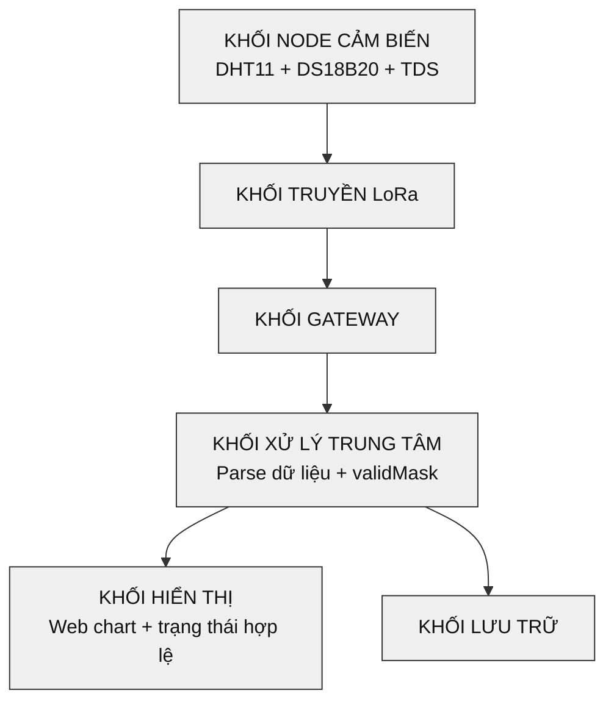
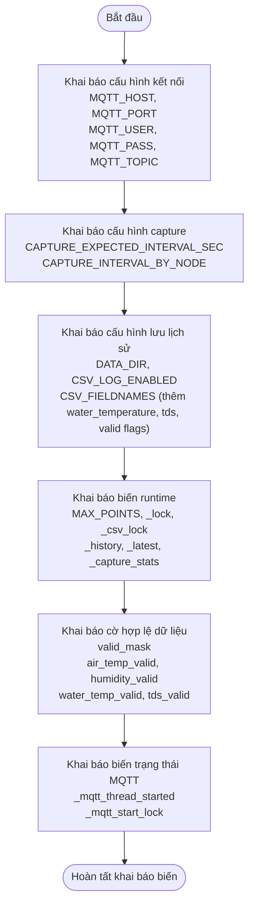
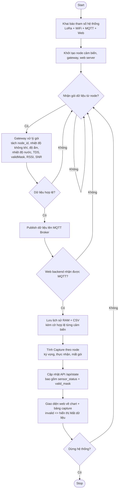

# Tổng hợp code sơ đồ khối (Mermaid)

## 1) Sơ đồ khối hệ thống (dạng block đơn giản)

```mermaid
flowchart TB
    A[KHỐI NODE CẢM BIẾN<br/>DHT11 + DS18B20 + TDS]
    B[KHỐI TRUYỀN LoRa]
    C[KHỐI GATEWAY]
    D[KHỐI XỬ LÝ TRUNG TÂM<br/>Parse dữ liệu + validMask]
    E[KHỐI HIỂN THỊ<br/>Web chart + trạng thái hợp lệ]
    F[KHỐI LƯU TRỮ]

    A --> B --> C --> D
    D --> E
    D --> F

    style A fill:#efefef,stroke:#333,stroke-width:1px,color:#111
    style B fill:#efefef,stroke:#333,stroke-width:1px,color:#111
    style C fill:#efefef,stroke:#333,stroke-width:1px,color:#111
    style D fill:#efefef,stroke:#333,stroke-width:1px,color:#111
    style E fill:#efefef,stroke:#333,stroke-width:1px,color:#111
    style F fill:#efefef,stroke:#333,stroke-width:1px,color:#111
```

## 2) Sơ đồ khối phần khai báo biến (web backend)

```mermaid
flowchart TB
    A([Bắt đầu])

    B["Khai báo cấu hình kết nối<br/>MQTT_HOST, MQTT_PORT<br/>MQTT_USER, MQTT_PASS, MQTT_TOPIC"]
    C["Khai báo cấu hình capture<br/>CAPTURE_EXPECTED_INTERVAL_SEC<br/>CAPTURE_INTERVAL_BY_NODE"]
    D["Khai báo cấu hình lưu lịch sử<br/>DATA_DIR, CSV_LOG_ENABLED<br/>CSV_FIELDNAMES (thêm water_temperature, tds, valid flags)"]
    E["Khai báo biến runtime<br/>MAX_POINTS, _lock, _csv_lock<br/>_history, _latest, _capture_stats"]
    F["Khai báo cờ hợp lệ dữ liệu<br/>valid_mask<br/>air_temp_valid, humidity_valid<br/>water_temp_valid, tds_valid"]
    G["Khai báo biến trạng thái MQTT<br/>_mqtt_thread_started<br/>_mqtt_start_lock"]

    H([Hoàn tất khai báo biến])

    A --> B --> C --> D --> E --> F --> G --> H
```

## 3) Sơ đồ khối hệ thống dạng luồng xử lý

```mermaid
flowchart TD
    A([Start]) --> B[Khai báo tham số hệ thống<br/>LoRa + WiFi + MQTT + Web]
    B --> C[Khởi tạo node cảm biến, gateway, web server]
    C --> D{Nhận gói dữ liệu từ node?}

    D -- "Không" --> D
    D -- "Có" --> E[Gateway xử lý gói<br/>tách node_id, nhiệt độ không khí, độ ẩm,<br/>nhiệt độ nước, TDS, validMask, RSSI, SNR]

    E --> F{Dữ liệu hợp lệ?}
    F -- "Không" --> D
    F -- "Có" --> G[Publish dữ liệu lên MQTT Broker]

    G --> H{Web backend nhận được MQTT?}
    H -- "Không" --> D
    H -- "Có" --> I[Lưu lịch sử RAM + CSV<br/>kèm cờ hợp lệ từng cảm biến]

    I --> J[Tính Capture theo node<br/>kỳ vọng, thực nhận, mất gói]
    J --> K[Cập nhật API /api/state<br/>bao gồm sensor_status + valid_mask]
    K --> L[Giao diện web vẽ chart + bảng capture<br/>invalid => hiển thị Mất dữ liệu]

    L --> M{Dừng hệ thống?}
    M -- "Không" --> D
    M -- "Có" --> N([Stop])
```
